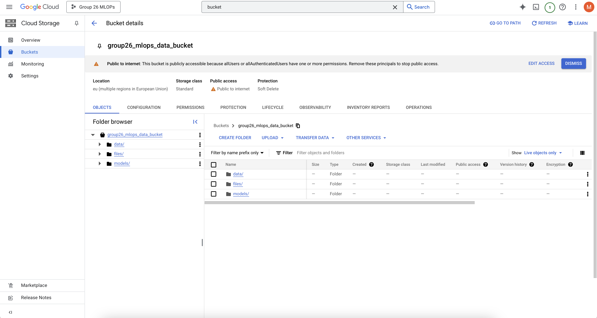

# Exam template for 02476 Machine Learning Operations

This is the report template for the exam. Please only remove the text formatted as with three dashes in front and behind
like:

```--- question 1 fill here ---```

Where you instead should add your answers. Any other changes may have unwanted consequences when your report is
auto-generated at the end of the course. For questions where you are asked to include images, start by adding the image
to the `figures` subfolder (please only use `.png`, `.jpg` or `.jpeg`) and then add the following code in your answer:

```markdown

```

In addition to this markdown file, we also provide the `report.py` script that provides two utility functions:

Running:

```bash
python report.py html
```

Will generate a `.html` page of your report. After the deadline for answering this template, we will auto-scrape
everything in this `reports` folder and then use this utility to generate a `.html` page that will be your serve
as your final hand-in.

Running

```bash
python report.py check
```

Will check your answers in this template against the constraints listed for each question e.g. is your answer too
short, too long, or have you included an image when asked. For both functions to work you mustn't rename anything.
The script has two dependencies that can be installed with

```bash
pip install typer markdown
```

## Overall project checklist

The checklist is *exhaustive* which means that it includes everything that you could do on the project included in the
curriculum in this course. Therefore, we do not expect at all that you have checked all boxes at the end of the project.
The parenthesis at the end indicates what module the bullet point is related to. Please be honest in your answers, we
will check the repositories and the code to verify your answers.

### Week 1

* [x] Create a git repository (M5)
* [x] Make sure that all team members have write access to the GitHub repository (M5)
* [x] Create a dedicated environment for you project to keep track of your packages (M2)
* [x] Create the initial file structure using cookiecutter with an appropriate template (M6)
* [x] Fill out the `data.py` file such that it downloads whatever data you need and preprocesses it (if necessary) (M6)
* [x] Add a model to `model.py` and a training procedure to `train.py` and get that running (M6)
* [x] Remember to fill out the `requirements.txt` and `requirements_dev.txt` file with whatever dependencies that you
    are using (M2+M6)
* [x] Remember to comply with good coding practices (`pep8`) while doing the project (M7)
* [x] Do a bit of code typing and remember to document essential parts of your code (M7)
* [x] Setup version control for your data or part of your data (M8)
* [ ] #TODO Update tasks.py at the end Add command line interfaces and project commands to your code where it makes sense (M9)
* [x] Construct one or multiple docker files for your code (M10)
* [x] Build the docker files locally and make sure they work as intended (M10)
* [x] Write one or multiple configurations files for your experiments (M11)
* [x] Used Hydra to load the configurations and manage your hyperparameters (M11)
* [x] Use profiling to optimize your code (M12)
* [x] Use logging to log important events in your code (M14)
* [x] Use Weights & Biases to log training progress and other important metrics/artifacts in your code (M14)
* [ ] Consider running a hyperparameter optimization sweep (M14)
* [x] Use PyTorch-lightning (if applicable) to reduce the amount of boilerplate in your code (M15)

### Week 2

* [x] Write unit tests related to the data part of your code (M16)
* [x] Write unit tests related to model construction and or model training (M16)
* [x] Calculate the code coverage (M16)
* [x] Get some continuous integration running on the GitHub repository (M17)
* [x] Add caching and multi-os/python/pytorch testing to your continuous integration (M17)
* [x] Add a linting step to your continuous integration (M17)
* [x] Add pre-commit hooks to your version control setup (M18)
* [x] Add a continues workflow that triggers when data changes (M19)
* [x] Add a continues workflow that triggers when changes to the model registry is made (M19)
* [x] Create a data storage in GCP Bucket for your data and link this with your data version control setup (M21)
* [x] Create a trigger workflow for automatically building your docker images (M21)
* [ ] Get your model training in GCP using either the Engine or Vertex AI (M21)
* [x] Create a FastAPI application that can do inference using your model (M22)
* [ ] Deploy your model in GCP using either Functions or Run as the backend (M23)
* [ ] Write API tests for your application and setup continues integration for these (M24)
* [ ] Load test your application (M24)
* [ ] Create a more specialized ML-deployment API using either ONNX or BentoML, or both (M25)
* [x] Create a frontend for your API (M26)

### Week 3

* [ ] Check how robust your model is towards data drifting (M27)
* [ ] Deploy to the cloud a drift detection API (M27)
* [ ] Instrument your API with a couple of system metrics (M28)
* [ ] Setup cloud monitoring of your instrumented application (M28)
* [ ] Create one or more alert systems in GCP to alert you if your app is not behaving correctly (M28)
* [ ] If applicable, optimize the performance of your data loading using distributed data loading (M29)
* [ ] If applicable, optimize the performance of your training pipeline by using distributed training (M30)
* [ ] Play around with quantization, compilation and pruning for you trained models to increase inference speed (M31)

### Extra

* [x] Write some documentation for your application (M32)
* [x] Publish the documentation to GitHub Pages (M32)
* [x] Revisit your initial project description. Did the project turn out as you wanted?
* [x] Create an architectural diagram over your MLOps pipeline
* [x] Make sure all group members have an understanding about all parts of the project
* [x] Uploaded all your code to GitHub

## Group information

### Question 1
> **Enter the group number you signed up on <learn.inside.dtu.dk>**
>
> Answer:


Group 26

### Question 2
> **Enter the study number for each member in the group**
>
> Example:
>
> *sXXXXXX, sXXXXXX, sXXXXXX*

s193992, s215225, s215158, s215133, s242507


### Question 3
> **A requirement to the project is that you include a third-party package not covered in the course. What framework**
> **did you choose to work with and did it help you complete the project?**
>
> Recommended answer length: 100-200 words.
>
> Example:
> *We used the third-party framework ... in our project. We used functionality ... and functionality ... from the*
> *package to do ... and ... in our project*.
>
> Answer:

In our project, we used the `transformers` as the third-party package. It is from Hugging Face. We chose it because of its ease of use and wide support for pre-trained models. Specifically, we leveraged the `t5-small model` for our task of translating Danish to English. The `transformers` package provided a straightforward interface to load and fine-tune the model, making it easy to implement in our project. We used its functionality to tokenize the input text and generate accurate translations. This framework significantly expedited our work and ensured high-quality results, allowing us to focus more on the application logic rather than low-level implementation details.

## Coding environment

> In the following section we are interested in learning more about you local development environment. This includes
> how you managed dependencies, the structure of your code and how you managed code quality.

### Question 4

> **Explain how you managed dependencies in your project? Explain the process a new team member would have to go**
> **through to get an exact copy of your environment.**
>

To manage dependancies we used the `uv` package manager because it allows for simple package installation and ensures
consistent environments across different machines. After downloading and installing `uv`, running `uv venv` will create
your virtual environment then running `uv init` will create the `pyproject.toml` and `uv.lock` in the project.
To add packages we can run `uv add` for example: `uv add requests`. This command adds the package to `pyproject.toml`,
updates the `uv.lock` file, and syncs the environment. If needed packages
can be removed with `uv remove requests`.

For a new team member:

```
    1. Clone the project repository.
    2. Install uv if not already installed.
    3. Run the `uv sync` in the project directory
```

### Question 5

> **We expect that you initialized your project using the cookiecutter template. Explain the overall structure of your**
> **code. What did you fill out? Did you deviate from the template in some way?**
>
> Recommended answer length: 100-200 words
>
> Example:
> *From the cookiecutter template we have filled out the ... , ... and ... folder. We have removed the ... folder*
> *because we did not use any ... in our project. We have added an ... folder that contains ... for running our*
> *experiments.*
>
> Answer:

As mentioned in the question, we have used the initial cookiecutter template for our initial structure of our code. We have filled out the majority of the pre-cut folders and files from the `MLOPs_template` cookiecutter template. Other than the folders already included in the cookie cutter template, we have added the following folders to the actual GitHub repository: `.dvc` and `.devcontainer`. The reason being is that we need it for the data version control and for the docker container. Otherwise, when running the code, the following folders are added `.ruff_cache`, `.pytest_cache` `logs` and`.mypy_cache`. The reason for these folders are mainly because they are mainly package dependant, for example: `ruff` and `pytest`. The reports folder is course specific to include figures and a `README.md` to answer the quetions asked. Lastly, we have removed the data folder from the GitHub repository since it has been moved to the dvc.

Therefore, the overall structure of our project aligns very closers to the template.

### Question 6

> **Did you implement any rules for code quality and format? What about typing and documentation? Additionally,**
> **explain with your own words why these concepts matters in larger projects.**
>
> Recommended answer length: 100-200 words.
>
> Example:
> *We used ... for linting and ... for formatting. We also used ... for typing and ... for documentation. These*
> *concepts are important in larger projects because ... . For example, typing ...*
>
> Answer:

Yes, we implemented `ruff` for linting. For type checking, we used `mypy` and included type annotations throughout the code. Additionally, we followed a clear documentation style using docstrings for all functions and classes. These concepts are important in larger projects because they help maintain consistency, readability, and reduce the likelihood of errors. Linting ensures code adheres to style guidelines, making it easier for multiple developers to collaborate. Type annotations and checking with `mypy` catch potential type errors early, leading to more robust and maintainable code. Documentation provides clarity for others (or yourself) when revisiting the code, improving knowledge transfer and reducing the learning curve. In large projects with many contributors, these practices ensure that the codebase remains clean, understandable, and scalable.

## Version control

> In the following section we are interested in how version control was used in your project during development to
> corporate and increase the quality of your code.

### Question 7

> **How many tests did you implement and what are they testing in your code?**
>
> Recommended answer length: 50-100 words.
>
> Example:
> *In total we have implemented X tests. Primarily we are testing ... and ... as these the most critical parts of our*
> *application but also ... .*
>
> Answer:

We have implemented seventeen tests in total to ensure the robustness and reliability of our project. We have mainly tested our data code and our model since these are essential parts of our project. And without a well-functioning model and data repository, we would not have a reliable and robout project.

### Question 8

> **What is the total code coverage (in percentage) of your code? If your code had a code coverage of 100% (or close**
> **to), would you still trust it to be error free? Explain you reasoning.**
>
> Recommended answer length: 100-200 words.
>
> Example:
> *The total code coverage of code is X%, which includes all our source code. We are far from 100% coverage of our **
> *code and even if we were then...*
>
> Answer:

The total code coverage of our code as of now is 31%. However, as we have only tested the data repository and our model, our total test coverage will be low. But for the tested parts, we have 80% test coverage for our data repository, and we have 72% test coverage for our model. Even if our code had a test coverage of 100%, we would not trust it to be error free. The reason being is that test coverage is not a meassure of correctness but its an indication of how much of the code has been ran during the testing. So there might be cases where the code is not behaving as expected, because it has not been covered in the tests even though the test coverage is 100%.

### Question 9

> **Did you workflow include using branches and pull requests? If yes, explain how. If not, explain how branches and**
> **pull request can help improve version control.**
>
> Recommended answer length: 100-200 words.
>
> Example:
> *We made use of both branches and PRs in our project. In our group, each member had an branch that they worked on in*
> *addition to the main branch. To merge code we ...*
>
> Answer:

Yes, we used feature branches and pull requests (PRs) as part of our version control process. Each team member worked on their own branch, isolated from the `main` branch, to implement features or fix bugs. When the work was ready, a pull request was created to propose merging the changes back into main.

To ensure stability and code quality, each PR included automated tests that ran as part of the CI/CD pipeline. This ensured that before code was merged, it passed all unit tests, integration tests, and any other relevant checks. This step was crucial in maintaining code reliability, as it caught regressions or potential issues early in the review process. Any failing tests would block the merge, forcing us to address issues before integration.

The use of PRs with automated tests provides a safety net in larger projects, where manual testing alone is not sufficient. It allows for continuous validation of code and ensures that only thoroughly tested, high-quality code is added to the main branch. This improves collaboration, reduces integration problems, and maintains the overall stability of the project.

### Question 10

> **Did you use DVC for managing data in your project? If yes, then how did it improve your project to have version**
> **control of your data. If no, explain a case where it would be beneficial to have version control of your data.**
>
> Recommended answer length: 100-200 words.
>

We used both DVC and GCS to manage our data, leveraging the version control capabilities for two main benefits: reproducibility and scalability. Given that our team was working across three different operating systems, being able to access and store data on a centralized server proved highly beneficial. Additionally, DVC ensured that the same version of the data was used across all environments, which helped maintain consistency throughout the project. Our dataset did not have many modifications, but if we were to have changed datasets to a larger or smaller size, different words, etc. DVC would have been an incredible asset as well.

### Question 11

> **Discuss you continuous integration setup. What kind of continuous integration are you running (unittesting,**
> **linting, etc.)? Do you test multiple operating systems, Python  version etc. Do you make use of caching? Feel free**
> **to insert a link to one of your GitHub actions workflow.**
>
> Recommended answer length: 200-300 words.
>
> Example:
> *We have organized our continuous integration into 3 separate files: one for doing ..., one for running ... testing*
> *and one for running ... . In particular for our ..., we used ... .An example of a triggered workflow can be seen*
> *here: <weblink>*
>
> Answer:

We have organized our continuous integration (CI) setup into several distinct workflows using GitHub Actions. Our CI pipeline includes the following key stages:

- Unit Testing: We use pytest for unit testing and ensure that all tests pass on each PR. This helps us catch regressions and bugs early in the development process.

- Linting and Code Quality Checks: We run ruff for linting to enforce code style consistency and mypy for type checking to catch potential type errors. This ensures that our code adheres to best practices and reduces technical debt.

- Cross-Environment Testing: We test our code across multiple Python versions to ensure compatibility and avoid issues related to different Python environments. Additionally, we test our code on multiple operating systems, including Ubuntu and macOS, to ensure it runs consistently across platforms.

- Caching: To speed up the CI process, we make use of caching for dependencies. By caching our Python dependencies and other build artifacts (e.g., test results), we reduce redundant installations and speed up the overall build time.

- Deploy Docs: We used MkDocs for documenting our code, so if a new function is added or existing documentation is updated, the changes are automatically deployed to GitHub Pages. This ensures that our documentation is always up-to-date and accessible.

An example of the triggered CI workflow can be seen in our GitHub Actions configuration here: https://github.com/Jacopo00811/group26-mlops-project/actions/runs/12906222864

An example of one of our GitHub actions workflow files: https://github.com/Jacopo00811/group26-mlops-project/blob/main/.github/workflows/tests.yaml

This CI setup allows us to quickly validate changes across different environments, catch issues early, and maintain high code quality. It is particularly valuable in a collaborative setting where multiple developers are working on the same codebase, ensuring that all changes are well-tested, linted, and verified before they are merged.

## Running code and tracking experiments

> In the following section we are interested in learning more about the experimental setup for running your code and
> especially the reproducibility of your experiments.

### Question 12

> **How did you configure experiments? Did you make use of config files? Explain with coding examples of how you would**
> **run a experiment.**
>
> Recommended answer length: 50-100 words.
>
> Example:
> *We used a simple argparser, that worked in the following way: Python  my_script.py --lr 1e-3 --batch_size 25*
>
> Answer:

We configured our experiments using Hydra and YAML configuration files. The main configuration file (`config.yaml`) specifies the default experiment configuration. Each experiment has its own YAML file (e.g., `exp1.yaml`, `exp2.yaml`) that defines specific parameters such as model name, batch size and learning rate. To run an experiment, we can use the following command:

python src/danish_to_english_llm/train.py experiment=exp2

### Question 13

> **Reproducibility of experiments are important. Related to the last question, how did you secure that no information**
> **is lost when running experiments and that your experiments are reproducible?**
>
> Recommended answer length: 100-200 words.
>
> Example:
> *We made use of config files. Whenever an experiment is run the following happens: ... . To reproduce an experiment*
> *one would have to do ...*
>
> Answer:

To have reproducibility of our experiments, we used Hydra and YAML files to define all experiment parameters. These configuration files are stored in the `configs` directory and are version-controlled using Git. This ensures that all changes to the configuration files are tracked and can be reverted if necessary.

During the experiments, we log important events and metrics using the `loguru` library. The logs are stored in the `logs` directory, providing a detailed record of each experiment. We also use Weights & Biases (wandb) to track the experiments. This ensures that everything is stored and can be accessed later. By combining all of this, we can be sure that no information is lost and that our experiments are fully reproducible.

### Question 14

> **Upload 1 to 3 screenshots that show the experiments that you have done in W&B (or another experiment tracking**
> **service of your choice). This may include loss graphs, logged images, hyperparameter sweeps etc. You can take**
> **inspiration from [this figure](figures/wandb.png). Explain what metrics you are tracking and why they are**
> **important.**
>
> Recommended answer length: 200-300 words + 1 to 3 screenshots.
>
> Example:
> *As seen in the first image when have tracked ... and ... which both inform us about ... in our experiments.*
> *As seen in the second image we are also tracking ... and ...*
>
> Answer:

We managed to train our model locally twice. In our experiments, we used Weights & Biases (W&B) to track our metrics and visualize the performance of our model. The following screenshots show some of the metrics we tracked during our experiments.


Here, the first picture is of an experiment where our model ran for only one epoch since it took about 5 hours to train a single epoch. However, we felt that it didnt show if the model would generalize well to unforseen data. Therefore, we ran another experiment with the same parameters, as the first experiment, but just over five epochs instead of only one epoch. This is what we see in the second picture. As seen in the images, we did track the training and validation loss over the epochs. This was done because tracking the loss is a great way to try and understand how well the model is learning from the training data and how well it generalizes to unseen validation data. A decreasing training loss indicates that the model is fitting well to the training data. And a decreasing validation loss suggests that the model is generalizing well to new unseen data. This is the case for our experiment, the one that ran for 5 epochs, which can see in the second picture.

### Question 15

> **Docker is an important tool for creating containerized applications. Explain how you used docker in your**
> **experiments/project? Include how you would run your docker images and include a link to one of your docker files.**
>
> Recommended answer length: 100-200 words.
>
> Example:
> *For our project we developed several images: one for training, inference and deployment. For example to run the*
> *training docker image: `docker run trainer:latest lr=1e-3 batch_size=64`. Link to docker file: <weblink>*
>
> Answer:

Docker is used to run the training file, leveraging an NVIDIA container image for PyTorch as the base. On top of this, the src folder, requirements.txt files, models folder, and config folder are added. The environment is then configured by installing the required packages listed in the requirements.txt files. Additionally, the Docker container is mounted to the data folder and requires an API key to be provided as part of its environment variables at runtime. Furthermore, for every pull request that passes the tests, the Docker image is automatically built on Google Cloud. This setup ensures consistency across different environments and simplifies the deployment process. By using Docker, we can easily share and reproduce our development environment. Thereby making collaboration even more efficient.

### Question 16

> **When running into bugs while trying to run your experiments, how did you perform debugging? Additionally, did you**
> **try to profile your code or do you think it is already perfect?**
>
> Recommended answer length: 100-200 words.
>
> Example:
> *Debugging method was dependent on group member. Some just used ... and others used ... . We did a single profiling*
> *run of our main code at some point that showed ...*
>
> Answer:

Most of our code was either comming from PyTorch Lightning or inspired by the class modules, so debugging typically involved resolving issues related to integration or small customizations. When we ran into bugs, the approach varied by team member. Some relied heavily on using `print()` statements to trace variable values and identify where the logic was breaking. Others made use of advanced debugging tools like the `logger`.

Additionally, we made use of tools like `GitHub Copilot` and large language models (LLMs) to help us identify potential issues and suggest fixes. We also consulted with teaching assistants (TAs) for guidance when we hit roadblocks.

As for profiling, we did perform a single profiling run of the main code using `PyTorch profiling` to identify any performance bottlenecks. However, our project was relatively lightweight, and no major performance issues were identified. We felt the code was efficient enough for the scope of the project and didn't pursue further optimization unless a clear need arose.

## Working in the cloud

> In the following section we would like to know more about your experience when developing in the cloud.

### Question 17

> **List all the GCP services that you made use of in your project and shortly explain what each service does?**
>
> Recommended answer length: 50-200 words.
>
> Example:
> *We used the following two services: Engine and Bucket. Engine is used for... and Bucket is used for...*
>
> Answer:

We used `Cloud Storage Buckets` to store and manage various datasets, models, and output files generated during our experiments. This service provided a reliable and scalable solution for storing large files, ensuring easy access across different team members and project stages.

For compute-intensive tasks such as model training and batch processing, we utilized `Google Compute Engine`. This service allowed us to provision virtual machines (VMs) with the necessary specifications, enabling scalable and on-demand computing power. It was particularly useful for training our model.

Finally, we leveraged Artifact Registry to store and manage Docker images. This service helped us securely store our containerized environments, ensuring consistency and reproducibility across different machines and stages of the project. By managing artifacts in one centralized place, we streamlined deployment and version control processes.

Together, these GCP services provided a robust infrastructure for storage, computation, and environment management, which was critical to the success and scalability of our project.

### Question 18

> **The backbone of GCP is the Compute engine. Explained how you made use of this service and what type of VMs**
> **you used?**
>
> Recommended answer length: 100-200 words.
>
> Example:
> *We used the compute engine to run our ... . We used instances with the following hardware: ... and we started the*
> *using a custom container: ...*
>
> Answer:

We did not manage to get our model running on the GCP Compute Engine due to dependency issues with the PyTorch base layer and our own requirements file. However, if we had managed to resolve these issues, we would have used the Compute Engine to run our model training and inference tasks. Based on the course suggestions, we would have selected a VM with high specs such as a virtual machine with a high-end NVIDIA GPU (like the Tesla T4 or V100). These specs would have provided the necessary computing power to train our model without taking too much time per epoch.

### Question 19

> **Insert 1-2 images of your GCP bucket, such that we can see what data you have stored in it.**
> **You can take inspiration from [this figure](figures/bucket.png).**
>
> Answer:

You can see our GCP bucket from the following figures:




### Question 20

> **Upload 1-2 images of your GCP artifact registry, such that we can see the different docker images that you have**
> **stored. You can take inspiration from [this figure](figures/registry.png).**
>
> Answer:

You can see our GCP artifact registry from the below figures:


### Question 21

> **Upload 1-2 images of your GCP cloud build history, so we can see the history of the images that have been build in**
> **your project. You can take inspiration from [this figure](figures/build.png).**
>
> Answer:

Below is our GCP cloud build history:


### Question 22

> **Did you manage to train your model in the cloud using either the Engine or Vertex AI? If yes, explain how you did**
> **it. If not, describe why.**
>
> Recommended answer length: 100-200 words.
>
> Example:
> *We managed to train our model in the cloud using the Engine. We did this by ... . The reason we choose the Engine*
> *was because ...*
>
> Answer:

No, we unfortunately did not manage to train our model in the cloud using either the Engine or the Vertex AI. The reason for this, as mentioned in question 18, was because we had dependency issues with the PyTorch base image and certain specific versions of libraries required by our project. For example, some dependencies in our requirements.txt file were incompatible with the pre-installed packages in the PyTorch container. This resulted in version mismatches and runtime errors. These dependency conflicts prevented us from successfully setting up the environment in the cloud such that we could run our training tasks in the cloud.

(We got it to run on CPU but it would take too long obviously)

## Deployment

### Question 23

> **Did you manage to write an API for your model? If yes, explain how you did it and if you did anything special. If**
> **not, explain how you would do it.**
>
> Recommended answer length: 100-200 words.
>
> Example:
> *We did manage to write an API for our model. We used FastAPI to do this. We did this by ... . We also added ...*
> *to the API to make it more ...*
>
> Answer:

We did manage to write an API for our model using FastAPI. The API provides an endpoint to translate Danish text to English. We defined a Pydantic model for request and response validation to ensure the input and output data are correctly formatted. The API logs different parts of the code using a logger. We also created a frontend for the API using Streamlit. The frontend allows users to input Danish text and get the translated English text by interacting with the API. Additionally, we containerized the API using Docker, which simplifies deployment and ensures consistency across different environments. This approach allows us to deploy the API to the GCP.

### Question 24

> **Did you manage to deploy your API, either in locally or cloud? If not, describe why. If yes, describe how and**
> **preferably how you invoke your deployed service?**
>
> Recommended answer length: 100-200 words.
>
> Example:
> *For deployment we wrapped our model into application using ... . We first tried locally serving the model, which*
> *worked. Afterwards we deployed it in the cloud, using ... . To invoke the service an user would call*
> *`curl -X POST -F "file=@file.json"<weburl>`*
>
> Answer:

--- question 24 fill here ---

Currently locally -- hpoefulyl cloud.

### Question 25

> **Did you perform any unit testing and load testing of your API? If yes, explain how you did it and what results for**
> **the load testing did you get. If not, explain how you would do it.**
>
> Recommended answer length: 100-200 words.
>
> Example:
> *For unit testing we used ... and for load testing we used ... . The results of the load testing showed that ...*
> *before the service crashed.*
>
> Answer:

--- question 25 fill here ---

We will.

### Question 26

> **Did you manage to implement monitoring of your deployed model? If yes, explain how it works. If not, explain how**
> **monitoring would help the longevity of your application.**
>
> Recommended answer length: 100-200 words.
>
> Example:
> *We did not manage to implement monitoring. We would like to have monitoring implemented such that over time we could*
> *measure ... and ... that would inform us about this ... behaviour of our application.*
>
> Answer:

We did not manage to implement monitoring for our model. However, implementing monitoring would improve the longevity of our application because with monitoring we can track the performance of the model in real-time, so we can make sure that it continues to function as expected. With monitoring, we can track the stuff such as the errors, ressources or the response time, so we can see when there is an issue with the model. It is also possible to set up alerts with monitoring, so you will be allerted if unusual patterns or bad performance arises. Thereby, we can proactively maintain the model's accuracy and reliability for a longer period of time. To conclude, monitoring can be used to get insights into the model's behavior in production, so we can maintain the application for a longer period of time.

## Overall discussion of project

> In the following section we would like you to think about the general structure of your project.

### Question 27

> **How many credits did you end up using during the project and what service was most expensive? In general what do**
> **you think about working in the cloud?**
>
> Recommended answer length: 100-200 words.
>
> Example:
> *Group member 1 used ..., Group member 2 used ..., in total ... credits was spend during development. The service*
> *costing the most was ... due to ... . Working in the cloud was ...*
>
> Answer:

Over the entire run of this course, we ended up spending a total of about fifteen American dollars. The service that ended up cosing the most was the Compute Engine. It took up about fourteen out of the total fifteen dollars spent during this course. The reason for this was primarily because of the time spent trying to setting up, running and debugging our environment. Since we ran into constant dependency issues with the PyTorch base layer and our own requirements, a lot of time was wasted on failed setup attempts and reruns. For this reason, we think that working in the cloud was frustrating and inefficient. Despite the posibility of being able to scale and use better VMs, we found the cloud to be more trouble than help unfortunately. In hindsight, the time spent on cloud-related issues could have been used better on refining and training the model locally if we wanted a better model. However, since this is MLOps, cloud environments and their challenges is an essential part of the learning process even if they are frustrating.

### Question 28

> **Did you implement anything extra in your project that is not covered by other questions? Maybe you implemented**
> **a frontend for your API, use extra version control features, a drift detection service, a kubernetes cluster etc.**
> **If yes, explain what you did and why.**
>
> Recommended answer length: 0-200 words.
>
> Example:
> *We implemented a frontend for our API. We did this because we wanted to show the user ... . The frontend was*
> *implemented using ...*
>
> Answer:

Yes, we did implement some exstra stuff which are not covereed by other questions. To be more specific, we implemented a frontend for our API. The reason for creating the frontend was to provide a user-friendly interface for users where they could easily translate sentences from danish to english. The frontend was implemented using Streamlit. We created a simple interface where users can input Danish text and click a button to get the translated English text. The frontend sends a request to the FastAPI backend, which processes the translation and returns the result.

Addidtionally implemented MkDocs to write documentation for our code. Additionally, we published the documentation to GitHub Pages which you can see here: https://jacopo00811.github.io/group26-mlops-project/. We chose MkDocs for our documentation because it is easy to use, integrates well with GitHub Pages, and provides a clean layout for our documentation. It was implemented by creating a `mkdocs.yml` file to define the structure of the documentation. Then we added the docstring-based documentation in Markdown files and organized them in the `docs/source` directory. Lastly, we implemented a workflow file that will update the documentation website if a new fuction with documentation is added.

### Question 29

> **Include a figure that describes the overall architecture of your system and what services that you make use of.**
> **You can take inspiration from [this figure](figures/overview.png). Additionally, in your own words, explain the**
> **overall steps in figure.**
>
> Recommended answer length: 200-400 words
>
> Example:
>
> *The starting point of the diagram is our local setup, where we integrated ... and ... and ... into our code.*
> *Whenever we commit code and push to GitHub, it auto triggers ... and ... . From there the diagram shows ...*
>
> Answer:

--- question 29 fill here ---


The figure illustrates the machine learning operations pipeline for developing, testing, and deploying our model for translating danish to english sentences. The process begins with development or training on a local machine, where different experiments are being ran. Tools such as Weights & Biases (W&B) are utilized for tracking experiment results, while Hydra is used to manage configurations efficiently. Once the experiments are validated locally, we can commit changes to the GitHub repository using a pre-commit hook to ensure that the commits follow our defined coding standards.

When pushing code to our GitHub repository, automated workflows are triggered via GitHub Actions. These workflows handle tasks such as running unit tests, checking code style and quality using Ruff, validating type consistency with MyPy, generating documentation using MkDocs, and measuring test coverage. If all checks are passed successfully, the pipeline proceeds to containerization.

The validated code is built into a Docker image, which is then pushed to a container registry. This registry stores the latest build. Thereby making it accessible for deployment. The Docker image is pulled and deployed on an AI platform, which serves as the infrastructure to host and run the machine learning model. However, the deployment of the best-performing model has not been implemented yet. Users will then interact with the deployed model via an API frontend. And here they can submit queries to the server for translating danish sentences into english.

### Question 30

> **Discuss the overall struggles of the project. Where did you spend most time and what did you do to overcome these**
> **challenges?**
>
> Recommended answer length: 200-400 words.
>
> Example:
> *The biggest challenges in the project was using ... tool to do ... . The reason for this was ...*
>
> Answer:

The biggest challenges our team encountered during the project were centered around infrastructure limitations and technical setup, particularly with Google Cloud Services (GCS) and Docker usage.

One of the key hurdles we faced was the lack of GPU access in GCS (Compute/Vertex AI), which significantly slowed down model training. However, we were able to adjust our approach by using pretrained models for the Danish-to-English translation task. While we wouldn't have been able to fully evaluate the model's accuracy or fine-tune it during inference due to the lack of GPU, using pretrained models allowed us to verify that the MLOps pipeline itself was functioning correctly. This was a crucial step in ensuring that the system was running as expected, even though it didn't allow for full model training.

In addition to this, we faced several technical challenges with Docker. One of the more time-consuming issues was getting the data properly loaded into the Docker container. We ran into several roadblocks related to mounting volumes, file paths, and permissions between the host and the container. These issues slowed down progress initially, but our team collaborated closely to document and standardize the process, which ultimately solved the problem.

Another obstacle was ensuring the right dependencies were installed in the base Docker image. We ran into compatibility issues across different libraries, which required us to iterate on the Dockerfile multiple times. As the Docker images grew larger, the build times became longer, and local storage quickly filled up, sometimes reaching up to 250 GB. To address this, we optimized the Dockerfile by removing unnecessary dependencies and cleaning up unused layers, which helped reduce storage usage and build time.

Despite these technical challenges, we were able to successfully train the models, implement inference, and integrate the front-end and back-end systems. Thanks to the team’s collaboration and adaptability, we were able to navigate the setbacks and keep the project moving forward.

### Question 31

> **State the individual contributions of each team member. This is required information from DTU, because we need to**
> **make sure all members contributed actively to the project. Additionally, state if/how you have used generative AI**
> **tools in your project.**
>
> Recommended answer length: 50-300 words.
>
> Example:
> *Student sXXXXXX was in charge of developing of setting up the initial cookie cutter project and developing of the*
> *docker containers for training our applications.*
> *Student sXXXXXX was in charge of training our models in the cloud and deploying them afterwards.*
> *All members contributed to code by...*
> *We have used ChatGPT to help debug our code. Additionally, we used GitHub Copilot to help write some of our code.*
> Answer:

Student s193992 was primarily responsible for ensuring project coverage, assisting with overall debugging, and contributing to the report writing and documentation. They helped ensure that all sections of the project were covered and worked on verifying the functionality of various components.

Student s215225 took the lead on Docker deployment and GCS (Google Cloud Services) setup. They were in charge of configuring and managing the cloud infrastructure, setting up Docker containers for both training and inference, and ensuring smooth integration between the cloud and local systems.

Student s215158 focused mainly on the model development and training phases. They worked on designing and fine-tuning the machine learning models, which included preparing the dataset, training the models in GCS, and later integrating them into an API for inference.

Student s215133 contributed significantly to coverage, writing portions of the project report, and documentation. They ensured that all processes were properly documented and that the final report was cohesive and complete, detailing all aspects of the project.

Student s242507 worked on DVC (Data Version Control), GCS setup, API development, and contributed to report writing. They were involved in managing data pipelines and ensuring the models were integrated into a deployable API. Additionally, they helped with the final report writing and documentation.

All members contributed to the coding efforts and troubleshooting tasks. We utilized ChatGPT for debugging and refining certain sections of our code, particularly when resolving complex logic errors. Additionally, GitHub Copilot was used to help write boilerplate code, speeding up the development process and ensuring consistency across the codebase.
